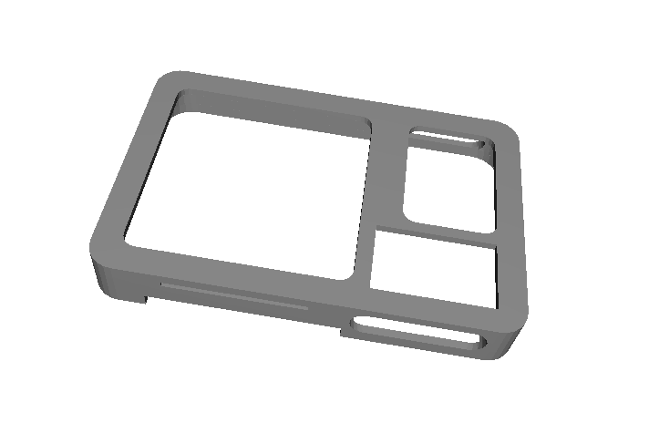
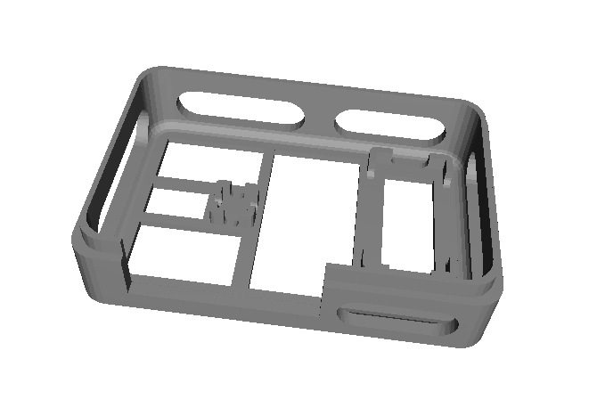
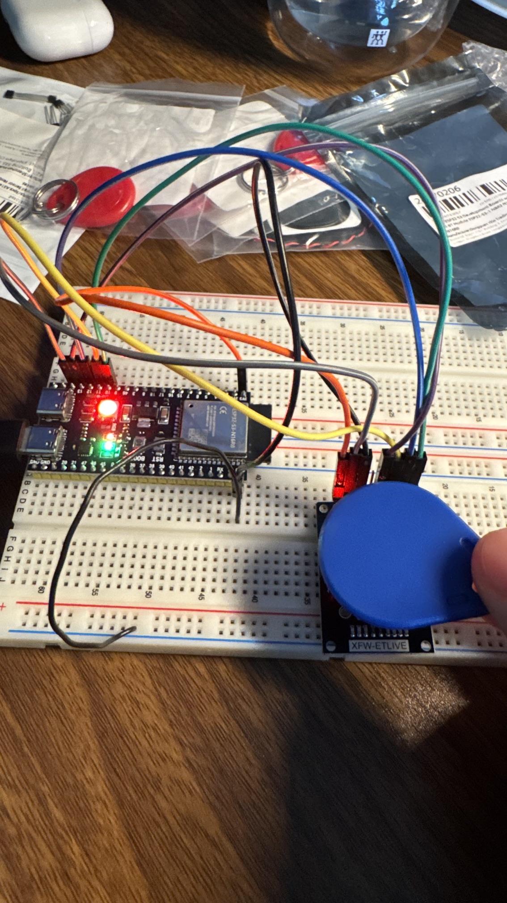
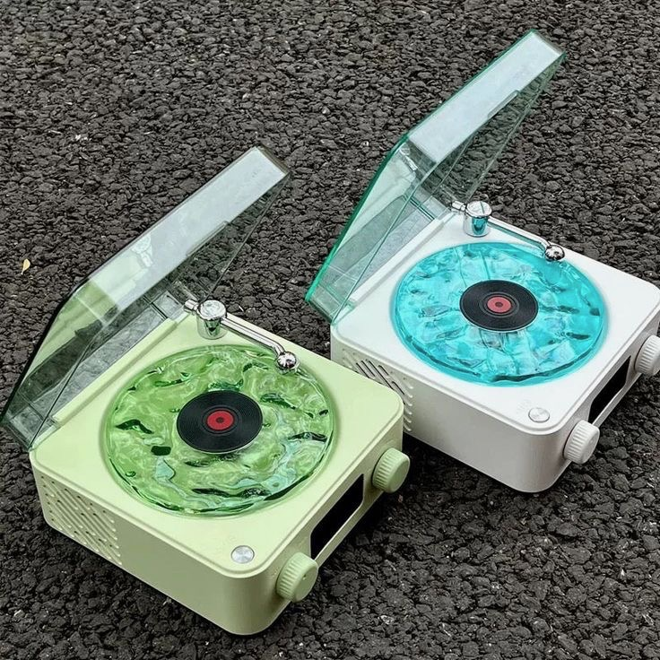

# RFID Record Player (work in progress) 🎵

A physical record player that plays music by scanning RFID-tagged "records". Tap a tag and it streams the matching track from Spotify. The ESP32-S3 talks to the Spotify API directly, with no backend server or companion app.

<p align="center">
  
  
  
  
</p>

## Highlights

- Tap-to-play: each RFID tag is mapped to a Spotify track
- Runs entirely on the ESP32, with no server in between
- Custom power delivery with an LM2596 buck converter, including a fix for a brownout caused by current spikes on the shared rail

## Hardware

- ESP32-S3
- RC522 RFID reader
- DFPlayer Mini
- Motor driver circuit
- LM2596 buck converter


### RC522 wiring

| RC522 | ESP32-S3 |
|-------|----------|
| SDA/SS | GPIO 10 |
| SCK | GPIO 12 |
| MOSI | GPIO 11 |
| MISO | GPIO 13 |
| RST | GPIO 14 |
| 3.3V / GND | 3V3 / GND |

## How it works

1. The RC522 reads a tag's UID.
2. The UID is looked up in a tag-to-track table.
3. The ESP32 refreshes its Spotify access token if needed.
4. It sends a play request to the Spotify Web API.

### Reading a tag

Scans are debounced so holding a tag on the reader doesn't restart the song.

```cpp
if (!mfrc522.PICC_IsNewCardPresent() || !mfrc522.PICC_ReadCardSerial()) {
  return;
}

String uid = getUidString();

if (uid == lastUid && (millis() - lastScanTime) < SCAN_COOLDOWN_MS) {
  mfrc522.PICC_HaltA();
  return;
}
```

### Mapping tags to tracks

Add a new record by adding a line to this table. Unknown tags print their UID to the serial monitor so you can copy it in.

```cpp
TagMapping tagMap[] = {
  {"00639C5C", "spotify:track:68HocO7fx9z0MgDU0ZPHro"},
};
```

### Spotify authentication

The device exchanges a saved refresh token for a short-lived access token and caches it until shortly before it expires.

```cpp
String body = "grant_type=refresh_token&refresh_token=" + String(REFRESH_TOKEN);
int httpCode = https.POST(body);

if (httpCode == 200) {
  deserializeJson(doc, https.getString());
  accessToken = doc["access_token"].as<String>();
  tokenExpiresAt = now + (doc["expires_in"].as<int>() - 60) * 1000UL;
}
```

### Playing a track

```cpp
https.begin(client, "https://api.spotify.com/v1/me/player/play");
https.addHeader("Authorization", "Bearer " + token);

String body = "{\"uris\":[\"" + trackUri + "\"]}";
int httpCode = https.PUT(body);   // 204 = playing
```

Full source: [`rfid_code/rfid_code.ino`](rfid_code/rfid_code.ino)

## Setup

1. Install the **MFRC522** and **ArduinoJson** libraries from the Arduino Library Manager.
2. Create an app in the [Spotify Developer Dashboard](https://developer.spotify.com/dashboard) and get a client ID, client secret, and refresh token.
3. Fill in your credentials at the top of the sketch:
```cpp
   const char* WIFI_SSID     = "your-wifi-name";
   const char* WIFI_PASSWORD = "your-wifi-password";
   const char* CLIENT_ID     = "your-client-id";
   const char* CLIENT_SECRET = "your-client-secret";
   const char* REFRESH_TOKEN = "your-refresh-token";
```
4. Flash the sketch to the ESP32-S3.
5. Open Spotify on any device so there's an active player, then tap a tag.

> Never commit your real credentials.

## Power debugging

The ESP32 was browning out when the motor started, because current spikes on the shared rail pulled the voltage down. Powering everything through an LM2596 buck converter fixed it.


